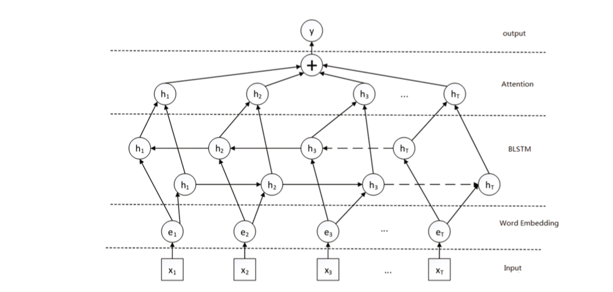
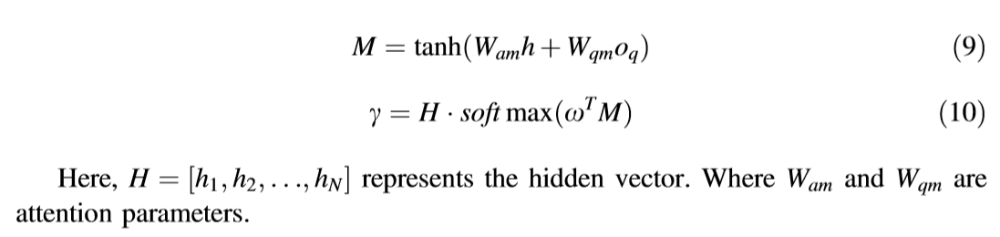
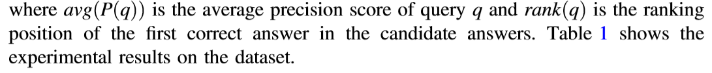
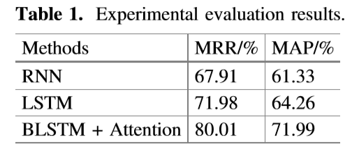
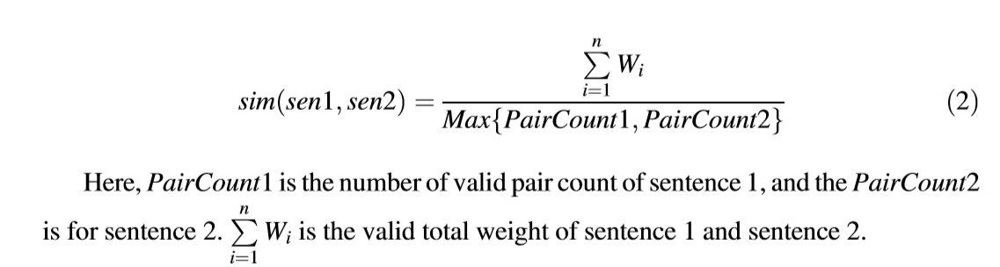

### 写文章的团队以及该团队的研究方向和进展

**团队**：Bo Song1, Yue Zhuo1, Xiaomei Li2

2016: *Personalized Intelligent Tutoring System of Primary Mathematics Based on Perl*

2018:本文

### 该文章的主要贡献，提出的模型特征和优势

1.提出的模型：BLSTM+Attention mechanism

2.模型优势：

BLSTM通过同时利用上下文更有效地对问题和答案进行匹配（提高MAP）

Attention mechanism可以关注于回答的关键信息并且忽略无关信息从而提高准确率（提高MRR）

### 该模型的结构框架、核心算法

#### 1. The model employs a BLSTM to learn the deep semantic features in the sentences and calculate the similarity distance of feature vectors

#### 2. Use the attention mechanism which allows the question to focus on a certain part of the candidate answer

#### 3.简而言之：这篇文章：BLSTM+Attention

#### 4.核心算法：

BLSTM模型和Attention机制

训练模型：梯度下降法

**这篇paper的实验细节：**

1. 初始化BLSTM模型并且将训练集Q,A翻译成Q',A',通过梯度下降法求解BLSTM和attention模型中的参数（? gradient descent 有点疑惑到底原理和过程是怎么样的，上网查感觉有点看不懂...）
2. 用户的问题语句q被分解转换为一组Word2vec向量q'.对于每一组q’中的向量。注意力机制会生成一个加权的表示γ.

### 模型结果 实验标准 数据集简要说明

#### 1. 数据集：NLPCC2017

#### 2.实验标准：

MAP和MRR

1. MAP: Mean Average Precision

   主集合的平均准确率(MAP)是每个主题的平均准确率的平均值。MAP 是反映系统在全部相关文档上性能的单值指标。系统检索出来的相关文档越靠前(rank 越高)，MAP就可能越高。如果系统没有返回相关文档，则准确率默认为0。
   例如：假设有两个主题，**主题1有4个相关网页，主题2有5个相关网页。某系统对于主题1检索出4个相关网页，其rank分别为1, 2, 4, 7；对于主题2检索出3个相关网页，其rank分别为1,3,5。**

   对于主题1，平均准确率为**(1/1+2/2+3/4+4/7)/4=0.83**。

   对于主题2，平均准确率为**(1/1+2/3+3/5+0+0)/5=0.45。则MAP= (0.83+0.45)/2=0.64**。”

2. MRR: Mean Reciprocal Rank

   是把标准答案在被评价系统给出结果中的排序取倒数作为它的准确度，再对所有的问题取平均。相对简单，举个例子：有3个query如下图所示：

   

   
(黑体为返回结果中最匹配的一项)

   可计算这个系统的MRR值为：(1/3 + 1/2 + 1)/3 = 11/18=0.61。

   

   

#### 3.模型结果：

### 心得体会：

这篇paper略水...只讲了一下自己把BLSTM和Attention mechanism结合起来搭了个新模型然后训练了一下就得到了一个结果，没有什么特别的创新点，整个paper大部分都是在介绍related work，更像一篇科普的文章。并且实验结果不知为何只和RNN和LSTM对比而不单独和BLSTM对比一下，也没有对比几种模型处理相同的数据集所用的时间如何。不过给了一种思路：组合多种模型来解决现有问题，分析其优劣。

##### 阅读笔记：

1.introduction

##### Ordinary search engines:

only get links may contain the required info->too many results(Baidu)

search engines based on keyword matching ->only focus on syntax of statement instead of semantics->users can not accurately express the info they need, impact the retrieval effect.

##### QA Sys:

1.ask question in natural language, directly return desired answer rather than relevant web pages.

2.

3 main tasks of QA system:

analysis of the questions/info retrieval/answer extraction

##### 2.related works:

1. QA sys before the paper: 

   1. mature:START/AnswerBus

   2. LASSO:(本体被用作知识的来源，可以用来理解无关信息的语义)
      1. 优点：针对每种问题设置相应的处理策略，大大提高问题分析的准确性
      2. 缺点：分类粒度太粗 
   3. AQUA: QA System in academic field
      1. 优点：结合NLP/Ontologies/Logic/Information Retrieval technologies in a uniform framework

   4. **QA system 取决于不同领域的分类**：Specific Domain QA, the Open Domain QA, the Frequently Asked Question system.

   1. FAQ:取决于QA对，优点在于高质量的问答的匹配，但特定领域的问答对数量相对少，限制了它的发展。

   1. CQA(Community-based Question Answering):a new kind of **data based on question-answer pairs**, **has more and more question-answer pairs but poor quality.**

2. Methods about QA-Answering

   1. FAQ:计算用户输入的问题语句和FAQ数据库中语句的相似度：

      1. **TF-IDF**: **sentence similarity calculation method based on word feature**

         1. 不考虑上下文中的语义联系
         2. 基于大规模语料的统计方法。仅当语料库达到一定大小时，才能反映该效果。
         3. 公式：余弦相似度（详见<a>https://www.cnblogs.com/dsgcBlogs/p/8619566.html</a>）

      2. **Sentence Similarity Computing Based on Semantic Dependency**

         1. 中心思想：核心动词是整个句子的主要成分，不仅不受其他成分的影响还可以控制其他句子成分。仅考虑句子的那些核心动词以及与之相关的单词的成对计数。这些对子包含了大部分的概念词。
         2. 使用这个方法分析的前提：提前获取句子各个组成成分之间的依赖关系。
         3. 公式：

      3. LSTM:(详见：<a href="https://www.zhihu.com/question/41949741">知乎上关于LSTM和RNN的讲解回答</a>）

         

##### 3.  Attention Based BLSTM Model

**！！！这篇paper的核心！！！**

1. BLSTM的优势：双向的LSTM：同时兼顾上文和下文，输出由双向的LSTM的输出来决定。
2. attention mechanism:人在面对不同事物是侧重点不同，注意力机制模仿这一特点并且自动给接受的信息赋权。
3. 给定一个问题Q，首先将它转化为*查询q*，然后找q的候选答案。答案候选池定义为A={a1,a2,...,an}.QA的目标是找到最佳候选答案ai（1≤ i ≤n)。如果选定的答案ai在q的真集中，q则被视作被正确地回答了，反之就是被错误地回答。
4. **这篇paper的实验细节：**
   
   1. 初始化BLSTM模型并且将训练集Q,A翻译成Q',A',通过梯度下降法求解BLSTM和attention模型中的参数（? gradient descent 有点疑惑到底原理和过程是怎么样的，上网查感觉有点看不懂...）
   
   2. 用户的问题语句q被分解转换为一组Word2vec向量q'.对于每一组q’中的向量。注意力机制会生成一个加权的表示γ.
   
      oq和ωT是个啥有点令人费解，初步推测oq是反向lstm的输出...至于ωT真的有点疑惑